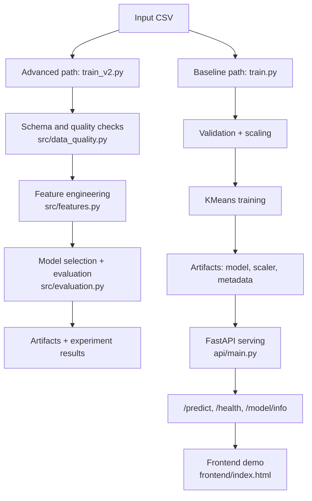

# Customer Segmentation ML System: Shipping a Baseline API While Building a More Rigorous ML Platform

## TL;DR
- I built an end-to-end customer segmentation system around a FastAPI inference service and a reproducible K-Means training pipeline.
- The repo intentionally has two layers: a simple, working baseline path (`train.py` -> `api/main.py`) and a more ambitious v2 path (`train_v2.py` + `src/`) for stricter data quality, richer features, and deeper evaluation.
- The advanced path adds schema gates, 24 engineered features, feature validation, business-facing segment analysis, and experiment-style artifacts.
- The serving layer exposes prediction, health, and model metadata endpoints, and the repo includes Docker packaging, CI, security scanning, and API tests.
- Verified baseline artifact metrics from `artifacts/model_metadata.json`: 191 samples, 5 clusters, silhouette score 0.3759, Davies-Bouldin 1.0121, Calinski-Harabasz 149.7547.
- A useful engineering lesson is visible in the repo itself: `train_v2.py` currently fails fast on the bundled sample CSV because it requires `customer_id`. The guardrail is working; the example data needs to be aligned.

## Problem & Why it Matters

Customer segmentation is a common business problem, but most portfolio projects stop at "fit K-Means on three columns and print clusters." This repo goes further in two ways:

1. It ships a usable baseline service:
   - `train.py` reads a CSV, validates it, scales features, trains `KMeans`, saves artifacts, and writes model metadata.
   - `api/main.py` loads those artifacts into a FastAPI app and exposes `/predict`, `/health`, and `/model/info`.

2. It also explores what a more production-minded version should look like:
   - `train_v2.py` orchestrates schema validation, data quality checks, advanced feature engineering, richer evaluation, and experiment artifacts.
   - `src/features.py`, `src/evaluation.py`, and `src/data_quality.py` encode the more interesting engineering decisions.

That split is important. It shows engineering judgment: keep a stable path that works, while building a stricter and more ambitious path beside it.

## System Overview

### Architecture description

There are effectively two runtime tracks in the repo:

- Baseline track:
  - Input CSV -> `train.py` -> `artifacts/kmeans_model.pkl`, `artifacts/scaler.pkl`, `artifacts/model_metadata.json` -> `api/main.py` -> `/predict`
- Advanced track:
  - Schema-compatible customer CSV -> `train_v2.py`
  - `train_v2.py` calls:
    - `SchemaValidator` and `DataQualityChecker` from `src/data_quality.py`
    - `FeatureEngineer` from `src/features.py`
    - `ClusteringEvaluator` and `BusinessMetricsEvaluator` from `src/evaluation.py`
  - Outputs richer artifacts such as `feature_engineer.pkl`, `model_metadata_v2.json`, and experiment JSON files

The baseline path is the one actually wired into CI (`.github/workflows/ci.yml`) and deployment (`.github/workflows/deploy.yml`). The v2 path is more interesting technically, but currently blocked by a schema mismatch with the bundled sample data.

### Diagram



## Data Pipeline

### Ingestion

The baseline path uses a lightweight CSV reader:

- `train.py` -> `read_dataset()`
- Required columns are defined in `REQUIRED_COLUMNS = ["age", "annual_income", "spending_score"]`
- Rows are parsed through `csv.DictReader` and converted to `np.float64`

The advanced path uses pandas ingestion:

- `train_v2.py` -> `validate_and_load_data()`
- Loads with `pd.read_csv()`
- Expects a stricter schema:
  - `customer_id: str`
  - `age: int`
  - `annual_income: int`
  - `spending_score: int`

### Cleaning / transforms

In the baseline path, `train.py` validates:

- empty datasets
- minimum sample count (`len(data) >= 10`)
- NaN values
- infinite values
- reasonable value ranges for age, income, and spending score

In the advanced path, `DataQualityChecker` in `src/data_quality.py` adds:

- completeness checks with a missing-value threshold
- validity checks against business constraints
- outlier detection (`zscore` or `iqr`)
- duplicate detection
- distribution analysis, including normality tests

The advanced path also writes a structured quality report through `save_quality_report()`.

### Splits and leakage prevention

This is one of the places where the repo is honest about current maturity:

- The code in `train.py` trains and evaluates on the same provided dataset.
- `train_v2.py` also evaluates on the training corpus after feature engineering.
- The docs (`docs/ML_SYSTEM_DESIGN.md`) describe time-based splits and cross-validation, but those are not implemented in the checked-in training code.

So the current leakage story is:

- Good:
  - preprocessing is fit during training and persisted for inference (`scaler.pkl` in baseline, `feature_engineer.pkl` in v2)
  - there is no label leakage because the project is unsupervised
- Still missing:
  - held-out evaluation
  - time-based validation for behavior-derived features
  - explicit safeguards against future-window leakage in the advanced feature set

That gap matters, and I would call it out directly in interviews instead of pretending it is already solved.

### Data contracts / schema checks

The strongest data-contract work is in the v2 path:

- `SchemaValidator.validate()` checks missing columns and dtype compatibility
- `DataQualityChecker.generate_report()` enforces thresholds for sample size, missingness, validity, outliers, duplicates, and distributions

This is not just theoretical. Running:

```bash
python3 train_v2.py --input data/sample_customers.csv
```

fails immediately because the bundled sample file does not include `customer_id`. That is a real example of a useful guardrail catching bad training input before feature generation or modeling.

## Feature Engineering

### Feature families

The baseline model uses only three direct inputs:

- `age`
- `annual_income`
- `spending_score`

The advanced feature path is more interesting. `FeatureEngineer` in `src/features.py` creates 24 features in four families:

1. RFM-style features
   - `recency_days`
   - `frequency`
   - `monetary_total`
   - `monetary_avg`
   - `monetary_std`
   - `monetary_min`
   - `monetary_max`
   - `monetary_range`
   - `monetary_cv`

2. Behavioral / temporal features
   - `avg_purchase_interval`
   - `purchase_interval_std`
   - `spending_trend`
   - `weekend_purchase_ratio`
   - `evening_purchase_ratio`
   - `unique_months_active`
   - `purchase_regularity`

3. Recent activity / acceleration features
   - `recent_purchase_count`
   - `recent_spend`
   - `purchase_acceleration`
   - `spending_acceleration`
   - `is_active_recent`

4. Lifetime / tenure features
   - `total_lifetime_value`
   - `customer_tenure_days`
   - `purchase_frequency_per_month`

These features are derived from transaction-style data, which is why `train_v2.py` synthesizes dated transaction rows from the flat customer CSV before calling `FeatureEngineer`.

### Online / offline parity concerns

This repo exposes a real parity issue that is worth discussing explicitly:

- Offline v2 training persists `feature_engineer.pkl`
- Online serving in `api/main.py` does not load or apply that artifact
- The API currently serves the baseline 3-feature path only

So the repo has the right instinct for parity, because preprocessing is serialized, but it has not yet promoted the advanced feature pipeline into the online serving path. That is the next engineering step if v2 becomes the production path.

### Feature validation

`FeatureEngineer.validate_features()` checks for:

- missing values
- infinite values
- zero-variance features
- highly correlated feature pairs
- outlier-heavy columns

`train_v2.py` then drops zero-variance features before scaling. The scaler is also configurable:

- `standard`
- `robust`
- `minmax`

That matters because clustering quality is very sensitive to feature scale and degenerate columns.

## Modeling Approach

### Baselines

The baseline production path is deliberately simple:

- `train.py` trains `KMeans`
- default `n_clusters=5`
- `n_init=10`
- `random_state=42`

The advanced path adds challenger baselines in `train_v2.py`:

- `simple_kmeans_k3`
- `kmeans_k5`

There are also signs of future modeling breadth:

- `MiniBatchKMeans` and `GaussianMixture` are imported in `train_v2.py`
- but they are not used in the actual training flow yet

### Final model choice

The implemented final choice is still `KMeans`, which is a reasonable decision for this problem:

- fast inference
- easy artifact footprint
- cluster centroids are easier to explain to business stakeholders than a more opaque model

### Objective / loss

For the actual model fit, the underlying objective is K-Means inertia:

- minimize the sum of squared distances from points to assigned centroids

The repo then evaluates that fit using clustering-quality metrics rather than treating inertia alone as sufficient.

### Tuning strategy

The baseline script keeps cluster count configurable via CLI:

```bash
python train.py --input data/sample_customers.csv --n_clusters 3
```

The advanced path adds a small hyperparameter sweep:

- `optimize_and_train()` tests `k` from 3 to 8
- selects the best `k` by silhouette score
- logs both silhouette and Davies-Bouldin per candidate

That is a pragmatic tuning strategy: cheap enough to run locally, but still better than hardcoding `k` with no evidence.

## Evaluation & Reliability

### Metrics (and why)

The baseline training path records four standard clustering metrics in `model_metadata.json`:

- `inertia`
  - compactness of clusters
- `silhouette_score`
  - cohesion vs separation
- `davies_bouldin_score`
  - lower means better-separated clusters
- `calinski_harabasz_score`
  - higher means denser, better-separated clusters

The advanced evaluator in `src/evaluation.py` goes further:

- `cluster_balance`
  - sanity check against badly skewed cluster sizes
- per-cluster silhouette distributions
  - exposes weak clusters hidden by a global average
- centroid separation metrics
  - inter-cluster vs intra-cluster distance ratio
- `overall_quality_score`
  - a 0-100 composite score derived from normalized silhouette and Davies-Bouldin

### Error analysis / slices

The most useful error-analysis primitives are in `ClusteringEvaluator`:

- `analyze_silhouette_distribution()`
  - cluster-level stats, including percentage of negative-silhouette samples
- `identify_problematic_samples()`
  - identifies samples below a configurable silhouette threshold
- `calculate_confidence_scores()`
  - computes distance-based confidence for each clustered sample

On the business side, `BusinessMetricsEvaluator` adds:

- segment profiles
- segment ranking by value
- segment lift relative to the population average

That is a good example of not stopping at pure ML metrics. The output becomes more useful to a product or growth team once clusters are ranked and characterized.

### Failure modes and mitigations

Implemented mitigations:

- invalid API payloads are blocked by Pydantic field constraints in `CustomerInput`
- unavailable model artifacts trigger a 503 via `get_model_container()`
- deprecated clients are protected by keeping `/get_segment` alive as a shim over `/predict`
- Docker and Compose both define health checks against `/health`
- the advanced training path fails fast on schema mismatches and poor data quality

Observed reliability gaps from local verification:

- `train_v2.py` currently cannot run on the bundled sample data because `customer_id` is missing
- the checked-in tests cover the baseline path well, but not the v2 modules
- `tests/test_train.py` contains two failing cases because `train.validate_data()` checks "dataset too small" before NaN/Inf checks
- default `pytest` depends on `pytest-cov` because coverage flags are hardcoded in `pytest.ini`

These are useful portfolio signals because they show the repo contains both engineering ambition and real edges that still need to be closed.

## Inference & Serving

### Batch vs online

What is actually implemented today is online inference:

- FastAPI service in `api/main.py`
- single-record prediction endpoint `/predict`

Batch and streaming ideas appear in the docs, but they are not implemented in runtime code. I would not claim batch inference support from this repo.

### Artifact loading strategy

`ModelContainer` in `api/main.py` loads artifacts once at startup:

- `kmeans_model.pkl`
- `scaler.pkl`
- optional `model_metadata.json`

This is a good fit for a small, low-latency inference service:

- avoids per-request disk I/O
- centralizes model availability checks
- gives the API a clean way to expose metadata through `/model/info`

### API design

The API surface is small and practical:

- `GET /`
  - service info
- `GET /health`
  - health and artifact-loaded status
- `GET /model/info`
  - model type, cluster count, feature list, and metadata
- `POST /predict`
  - main inference endpoint
- `POST /get_segment`
  - deprecated backward-compatible endpoint

The response also includes a distance-derived confidence score:

```python
confidence = 1 / (1 + distances[segment_id])
```

That is a useful product touch. Many clustering demos return only a cluster ID.

### Latency considerations

The repo makes a good architectural choice for latency, even though it does not publish measured numbers:

- small feature vector
- `StandardScaler` + `KMeans`
- in-memory artifact loading
- simple REST interface

What is missing is measured latency. There is no checked-in P50/P95 benchmark, so I would describe the service as "lightweight" rather than claim a hard latency number.

## MLOps & Reproducibility

### Experiment tracking, configs, seeds

The baseline path writes reproducibility metadata through `save_metadata()` in `train.py`:

- `training_date`
- `model_type`
- `model_version`
- hyperparameters
- feature list
- data statistics
- evaluation metrics
- training config

The advanced path adds experiment-oriented structure:

- timestamped experiment names
- per-run experiment directory
- `experiment_results.json`
- `model_metadata_v2.json`
- `feature_engineer.pkl`

Randomness is also pinned in the modeling path:

- `random_state=42`
- `n_init=10`

### CI / tests

The repository includes solid baseline operational scaffolding:

- `tests/test_train.py`
  - unit and integration tests for training
- `tests/test_api.py`
  - API behavior, docs, and backward compatibility
- `.github/workflows/ci.yml`
  - Python 3.10, 3.11, 3.12 matrix
  - linting
  - type checking
  - training baseline artifacts for tests
  - Docker build and health-check validation
  - Trivy security scan
- `.github/workflows/deploy.yml`
  - rebuilds artifacts and pushes a Docker image to GHCR

The strongest testing trick is in `tests/conftest.py`, where the API fixture monkeypatches artifact paths so the service can be tested hermetically without relying on checked-in binaries.

### Monitoring / drift strategy

Implemented today:

- `/health` endpoint
- Docker health check
- Compose health check
- frontend polling of `/health` every 30 seconds

Available in code but not yet wired into a runtime loop:

- `DataDriftDetector` with PSI / KS / Wasserstein
- confidence-score generation in the evaluator

So the drift story is "module exists, integration still pending." That is credible and defensible.

## Results

### Verified results

The table below only includes values that are directly traceable to checked-in artifacts, code execution, or test execution.

| Area | Verified result | Evidence |
|---|---|---|
| Baseline training data size | 191 samples | `artifacts/model_metadata.json` |
| Baseline model | KMeans, 5 clusters | `artifacts/model_metadata.json`, `train.py` |
| Inertia | 135.7649 | `artifacts/model_metadata.json` |
| Silhouette score | 0.3759 | `artifacts/model_metadata.json` |
| Davies-Bouldin score | 1.0121 | `artifacts/model_metadata.json` |
| Calinski-Harabasz score | 149.7547 | `artifacts/model_metadata.json` |
| Cluster sizes | 53, 29, 23, 40, 46 | `artifacts/model_metadata.json` |
| Advanced feature count | 24 engineered features | direct execution of `FeatureEngineer.create_feature_matrix()` against a synthetic transaction sample |
| Baseline API surface | `/predict`, `/health`, `/model/info`, deprecated `/get_segment` | `api/main.py`, `tests/test_api.py` |
| Local baseline test run | 26 passed, 2 failed when run as `pytest -o addopts='' tests/test_train.py tests/test_api.py` | local verification against repo on 2026-03-10 |
| Advanced training status on bundled sample data | fails fast on missing `customer_id` | local verification of `python3 train_v2.py --input data/sample_customers.csv` on 2026-03-10 |

### Measurement Plan

The repo does not contain verified measurements for online latency, throughput, memory usage, or production drift rates. If I wanted to make this portfolio project stronger, I would add the following:

1. API latency and throughput
   - Instrument `api/main.py` around `predict_segment()` and `ModelContainer.predict()`
   - Record request duration, prediction duration, and error rate
   - Run a load test against `/predict`

2. Confidence calibration / low-confidence rate
   - Log the returned `confidence_score` distribution from `/predict`
   - Track segment distribution and low-confidence percentage over time

3. Drift monitoring
   - Persist inference payload summaries
   - Run `DataDriftDetector.detect_drift()` from `src/data_quality.py` against a training reference set and recent inference batches

4. Held-out evaluation
   - Add a time-based validation split in `train_v2.py`
   - Recompute clustering metrics on holdout windows to detect overfit behavior in derived features

## What I'd Improve Next

1. Unify the advanced training path with the shipped sample data
   - Either add `customer_id` to `data/sample_customers.csv` or synthesize one inside `train_v2.py`

2. Promote the advanced feature pipeline into serving
   - Load `feature_engineer.pkl` in `api/main.py`
   - Make online inference use the same feature transformation contract as offline training

3. Add true evaluation discipline
   - Implement time-based holdout evaluation and feature windows that prevent future information leakage

4. Wire runtime monitoring to the existing scaffolding
   - Hook `DataDriftDetector` into a periodic job or batch check
   - Publish latency and confidence metrics from the API

5. Expand test coverage to the advanced modules
   - Add unit tests for `src/features.py`, `src/evaluation.py`, `src/data_quality.py`, and the full `train_v2.py` flow
   - Fix the current validation-order mismatch exposed by `tests/test_train.py`

## How to Run / Demo

### Baseline path (working end to end)

Install dependencies:

```bash
pip install -r api/requirements.txt
```

Train the baseline model:

```bash
python train.py --input data/sample_customers.csv
```

Expected artifacts:

- `artifacts/kmeans_model.pkl`
- `artifacts/scaler.pkl`
- `artifacts/model_metadata.json`

Expected training summary:

- samples trained: 191
- number of clusters: 5
- silhouette score: about 0.3759

Start the API:

```bash
uvicorn api.main:app --host 0.0.0.0 --port 8000
```

Check health:

```bash
curl http://localhost:8000/health
```

Run a prediction:

```bash
curl -X POST http://localhost:8000/predict \
  -H "Content-Type: application/json" \
  -d '{"age": 35, "annual_income": 75000, "spending_score": 62}'
```

Optional frontend demo:

```bash
cd frontend
python3 -m http.server 3000
```

Then open:

- `http://localhost:3000`
- `http://localhost:8000/docs`

### Make-based shortcuts

```bash
make train
make serve
make test
```

### Advanced path (requires schema-compatible input)

The advanced training pipeline is invoked as:

```bash
python train_v2.py --input data/sample_customers.csv
```

Important note: with the bundled sample CSV, this currently fails because `train_v2.py` expects a `customer_id` column. With a schema-compatible CSV, the expected outputs are:

- `artifacts/kmeans_model.pkl`
- `artifacts/feature_engineer.pkl`
- `artifacts/model_metadata_v2.json`
- `experiments/<experiment_name>/data_quality_report.json`
- `experiments/<experiment_name>/experiment_results.json`
- `training.log`

## Appendix

### Key files / paths

- `train.py`
- `train_v2.py`
- `src/features.py`
- `src/evaluation.py`
- `src/data_quality.py`
- `api/main.py`
- `tests/test_train.py`
- `tests/test_api.py`
- `.github/workflows/ci.yml`
- `.github/workflows/deploy.yml`
- `api/Dockerfile`
- `docker-compose.yml`
- `artifacts/model_metadata.json`

### Proof artifacts

- `artifacts/model_metadata.json`
  - checked-in baseline training metrics and cluster sizes
- `tests/conftest.py`
  - hermetic API fixture with monkeypatched artifact paths
- `tests/test_api.py`
  - endpoint coverage, docs coverage, backward-compatibility coverage
- `tests/test_train.py`
  - training pipeline and metadata assertions
- `.github/workflows/ci.yml`
  - matrix CI, Docker validation, Trivy scan
- `api/Dockerfile`
  - multi-stage build, non-root runtime, health check
- `docker-compose.yml`
  - read-only artifact mount, service health check, restart policy

